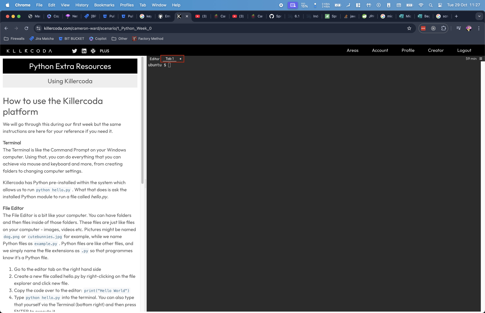
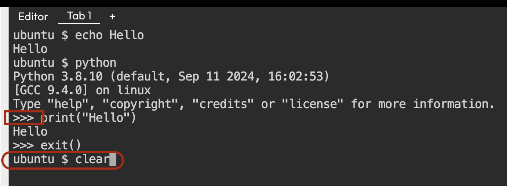
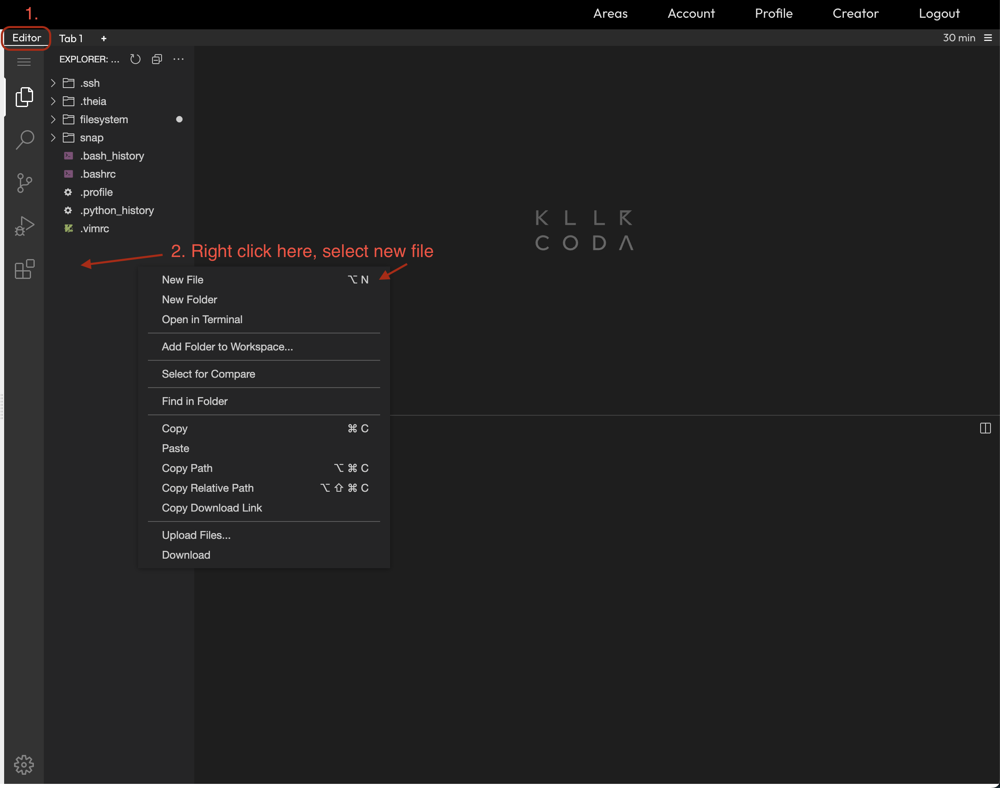
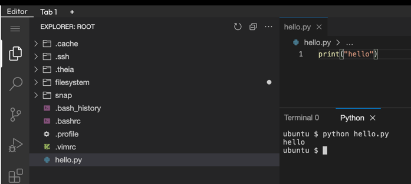

# How to use the Killercoda platform

We will go through this during our first week but the same instructions are here for your reference if you need it.

## The Terminal
With a terminal, you can do everything that you can achieve via mouse and keyboard and more, from creating folders to
changing computer settings.  
You can use the terminal within Killercoda on the right side of your screen under "tab 1": (each module you open will
start on this screen)   

It has some key features:

* Commands are typed in and then ran using the enter key.
    * Type in a command such as `echo hello`{{exec}} and press enter to run it.
* Previous commands you have run can be quickly accessed by using the up arrow key to save having to type them out all
  the time.
* If a terminal is too messy, type `clear`{{exec}} and press enter to clear the screen
* You can often type the first few letters of a command or file and press the tab key for the terminal to auto-complete the rest of the command
* To access the Python interpreter to run python code type `python`{{exec}} and press enter
    * You can tell when you are in Python Interpreter mode when the terminal shows the three >>> symbols
    * When in this mode you can type python commands and press enter such as `print("hello")`{{copy}}
    * To get out of the python interpreter and back to terminal mode type `exit()`{{copy}} and press enter

The commands mentioned above are used here:

## VS Code IDE
The terminal is great for running quick commands and running files but for larger programs we need an IDE (Integrated
Development Environment) which you can think of as a fancy file editor.
Killercoda provides VS Code in the browser, a popular IDE with programmers.

An IDE is a bit like your computer. You can have folders and then files inside of those folders. These files are just
like files on your computer - images, videos etc. Pictures might be named `dog.png` or `cutebunnies.jpg` for example,
while we name Python files as `example.py`.
Python files are like other files, and we simply name the file extensions as `.py` so that programmes know it's a Python
file.

**NOTE: Killercoda does not save your files**
* **When you open Killercoda it keeps your environment for 1 hour per session**
* **If you want to keep any of the files you create, make sure to copy the contents to your local machine**
* **The time you have left is shown at the very top right of your window**

To Access VS Code you can click the editor tab next to the terminal tab you were using previously.
It features:
* A file explorer on the left that we can use to create our python files
* A text editor on the right to edit the contents of our files
* A terminal (just like before) that we can use to run the files we create within Killercoda
 
### Running your first python file in Killercoda

1. Go to the editor tab on the right hand side
2. Right-click on the file explorer on the left and select new file

3. Name the file `hello.py`, when you press ok it should open up automatically, if not double-click it from the file explorer
4. Copy the code over to the editor: `print("Hello World")` and save it by pressing control (or command for mac) s 
5. Type `python hello.py`{{exec}} into the terminal and press enter to execute the file named `hello.py`

# Online Python Editors

Want to quickly write and run simple Python code but not install Python on your computer? Try some of these online
options!

- [replit](https://replit.com/languages/python3)
- [Google Colab](https://colab.research.google.com/)
- [W3Schools](https://www.w3schools.com/python/trypython.asp?filename=demo_compiler)
- [Visual Studio Code - Browser Version](https://vscode.dev/) (can edit but not run code)

<marquee style='color: blue;'><b>Yay you've completed part 1!</b></marquee>
