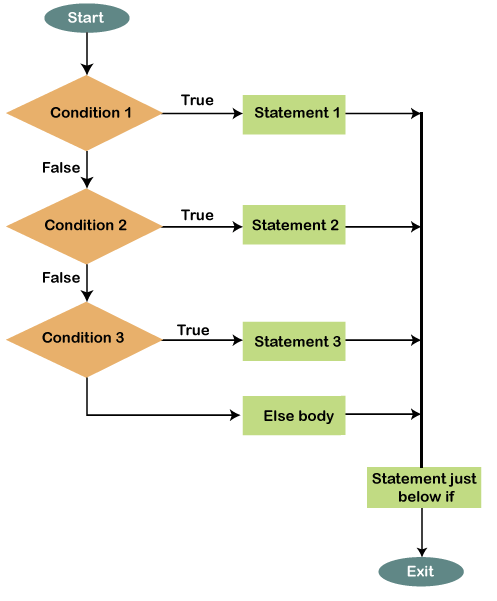

# Complex Selection (If, Else if, Else)



There are also **Else If** statements to check for secondary conditions. In Python Else If statements are abbreviated to 'elif'. Multiple Elif statements after each other are sometimes called a **cascade**.


* We can use else if to create more complicated selection statements.
* We might want to run a specific piece of code if a previous condition was false.
* E.g. If the user is choosing the number of people to stay in a hotel room they could have 3 options. If all three conditions are false we run the code in the else body

```
bookedRooms = 3

if bookedRooms == 1:
    print ("You have booked 1 room")
elif bookedRooms == 2:
    print ("You have booked 2 rooms")
else:
    print ("You can only book a maximum of 2 rooms")
    
print("cake?")
```{{copy}}

* We can use as many elif statements as we want. The only rule is that the else statement must come after all the else and if statements

## Useful string functions
* .upper()
* .lower()
* len(str)

We can use these on strings to either convert them all to upper case, lowercase or find out the length of a string. Try it out below:
```
myString = "Hello"
print(myString.lower())
```{{exec}}

```
myString = "Hello"
print(myString.upper())
```{{exec}}

```
myString = "Hello"
print(len(myString))
```{{exec}}

This can be useful in the following situation:
```
answer = input("Do you want to continue? Yes or no: ")
if answer.lower() == "yes":
print("you have continued")
else:
print("you have quit")
```{{copy}}

## Nested if statements:
This is where we have an if statement within another if statement and so on:

```
bookedRooms = 3
breakfast = True

if bookedRooms == 1:
print ("You have booked 1 room")
if breakfast:
print("You have booked breakfast each morning")
elif bookedRooms == 2:
print ("You have booked 2 rooms")
if breakfast:
print("You have booked breakfast each morning")
else:
print ("You can only book a maximum of 2 rooms")
```{{copy}}

# Exercises:
1. Ask user to enter 2 numbers.  If the number is the same, print “SNAP”. 
    * Added challenge – if the first number is higher, print “Your first number is higher than the second number”, else print “Your second number is higher than the first number”
2. Ask user to enter 3 numbers.  Print “SNAP” if all 3 numbers are the same.
    * Added challenge – print the smallest number if they are not the same. 
3. Write a program for the following:  
    * Three friends have been collecting money for charity.
    * A local company has offered to double the amount of money they collect if they raise over £1000.
    * Write a program that allows the friends to enter their individual amounts.
    * The program should then add the three amounts and store the total.
    * If the total is greater or equal to 1000, the total should be doubled.
    * Finally the total should be displayed.

4. Write a program that asks the user to enter 3 words.
* If all 3 are the same (ignoring case) then print "all three are the same"
* If two words (ignoring case) are the same, print: "two words are the same".
* Otherwise print, there are no words that are the same.

Congratulations you have completed Week 2!  
Kahoot time :)